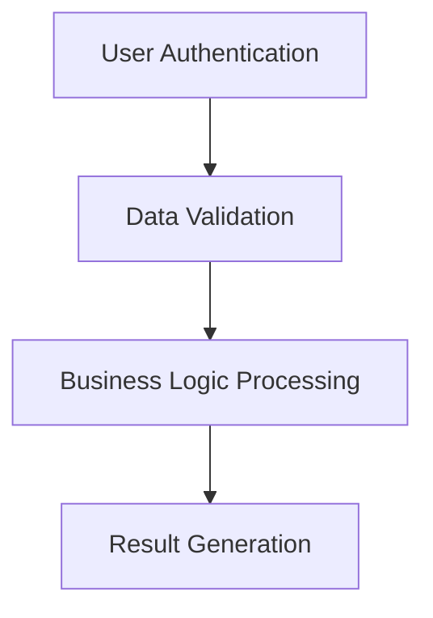

# BARE - Business Analyst Reverse Engineering

[](https://www.python.org/downloads/)
[](https://streamlit.io/)
[](https://ollama.ai/)

**AI-powered Reverse Requirements Bot to extract Business Requirements from Legacy Code**

BARE is an intelligent tool that analyzes Python codebases and automatically generates comprehensive Business Requirements Documents (BRDs) and process flow diagrams. It's designed to help business analysts, product managers, and development teams understand legacy systems and extract business value from existing code.

## 🚀 Features

- **📄 Code Analysis**: Parse Python files and ZIP archives
- **🔍 Function Extraction**: Automatically identify and analyze functions across multiple files
- **🔗 Interlink Detection**: Discover function dependencies and cross-file relationships
- **📋 BRD Generation**: Create comprehensive Business Requirements Documents
- **📊 Process Flow Diagrams**: Generate visual business process flows with Mermaid diagrams
- **📱 Web Interface**: User-friendly Streamlit web application
- **🖥️ Local LLM Support**: Works with Ollama local models (Mistral, StarCoder, WizardCoder, CodeLlama)
- **📄 PDF Export**: Download generated BRDs as professional PDF documents
- **⚡ Batch Processing**: Handle large codebases efficiently

## 🛠️ Installation

### Prerequisites

- Python 3.8 or higher
- [Ollama](https://ollama.ai/) installed and running locally

### Setup

1. **Clone the repository**
   ```bash
   git clone <repository-url>
   cd BARE
   ```

2. **Create a virtual environment**
   ```bash
   python -m venv venv
   
   # On Windows
   venv\Scripts\activate
   
   # On macOS/Linux
   source venv/bin/activate
   ```

3. **Install dependencies**
   ```bash
   pip install -r requirements.txt
   ```

4. **Install and start Ollama**
   ```bash
   # Install Ollama (follow instructions at https://ollama.ai/)
   
   # Pull required models
   ollama pull mistral
   ollama pull starcoder
   ollama pull wizardcoder
   ollama pull codellama:13b
   
   # Start Ollama server
   ollama serve
   ```

## 🚀 Usage

### Web Interface (Recommended)

1. **Start the Streamlit app**
   ```bash
   streamlit run demo.py
   ```

2. **Open your browser** and navigate to `http://localhost:8501`

3. **Upload your Python files**:
   - Individual `.py` files
   - ZIP archives containing Python files
   - Multiple files at once

4. **Configure settings**:
   - Choose your preferred LLM model
   - Select processing mode (Individual Functions or Batch Processing)
   - Enable PDF export if desired

5. **Generate BRD**: Click "Start BRD Generation" to analyze your code

6. **Generate Process Flow**: Click "Generate Process Flow Diagram" for visual workflows

### Command Line Interface

```bash
# Run the main application
python app.py

# Run the enhanced demo version
python demo.py
```

## 📋 Supported Models

BARE works with the following Ollama models:

- **Mistral** - Balanced performance and accuracy
- **StarCoder** - Specialized for code understanding
- **WizardCoder** - Excellent for technical analysis
- **CodeLlama 13B** - Large model for complex codebases

## 🏗️ Project Structure

```
BARE/
├── app.py                 # Main Streamlit application
├── demo.py               # Enhanced demo with additional features
├── backend.py            # Backend API server
├── requirements.txt      # Python dependencies
├── README.md            # This file
├── llm_engine/
│   └── run_local_llm.py # LLM integration with Ollama
├── parsers/
│   └── python_parser.py # Python code parsing and analysis
├── prompts/
│   └── brd_prompt.txt   # BRD generation prompt template
├── temp_code/           # Temporary code storage
└── venv/               # Virtual environment
```

## 🔧 Configuration

### Model Selection

Choose the appropriate model based on your needs:

- **For general analysis**: Mistral
- **For code-heavy projects**: StarCoder or WizardCoder
- **For complex enterprise systems**: CodeLlama 13B

### Processing Modes

- **Individual Functions (Recommended)**: Processes each function separately for better accuracy
- **Batch Processing**: Processes multiple functions together for faster results

## 📊 Output Examples

### Business Requirements Document

BARE generates structured BRDs including:

- Executive Summary
- Business Objectives
- Scope Definition
- Stakeholder Analysis
- Functional Requirements
- Non-Functional Requirements
- Assumptions and Constraints
- Technical Architecture Overview
- Success Metrics

### Process Flow Diagrams

Visual representations of business processes using Mermaid syntax:



## 🔍 How It Works

1. **Code Parsing**: Uses Python's AST to extract functions, classes, and dependencies
2. **Function Analysis**: Identifies interlinked functions across files
3. **LLM Processing**: Sends code to local LLM for business analysis
4. **BRD Generation**: Creates structured business requirements documents
5. **Process Flow**: Extracts business processes and creates visual diagrams
6. **PDF Export**: Generates professional PDF reports

## 🛠️ Development

### Adding New Models

To add support for new Ollama models:

1. Update the model selection in `demo.py`
2. Ensure the model is available in Ollama
3. Test with sample code

### Customizing Prompts

Edit `prompts/brd_prompt.txt` to customize the BRD generation format and style.

### Extending Parsers

Add new language support by creating parsers in the `parsers/` directory following the Python parser pattern.


## 🙏 Acknowledgments

- [Ollama](https://ollama.ai/) for local LLM capabilities
- [Streamlit](https://streamlit.io/) for the web interface
- [FPDF](https://pyfpdf.github.io/fpdf2/) for PDF generation
- [Mermaid](https://mermaid.js.org/) for diagram generation


